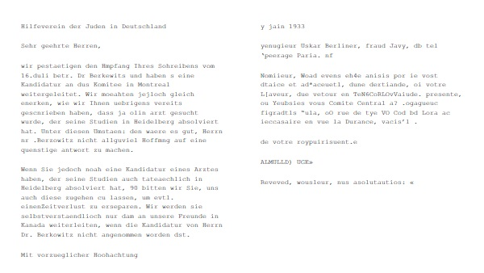
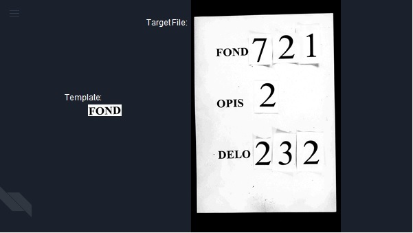

# OCR and Template Matching
The code found here was used in our HICEM experiment. The workflow includes the use of optical character recognition to push hocr text into a database which could then be used for named entity recognition.

Template matching was used to identify organization logos within the collection and document the location of those matches to the database.

## Getting Started
This section will provide setup instructions necessary to run the code

### Prerequisites
The following are recommended for running the above Python code in Windows
```
Anaconda
Tesseract
```

### Installation
Installation instructions for Anaconda can be found at
```
https://docs.anaconda.com/anaconda/install/windows/
```
Installation for Tesseract on Windows can be found at
```
https://github.com/UB-Mannheim/tesseract/wiki
```

## Running the Programs
### Optical Character Recognition
Some of the libraries imported in the code are not packaged with Python out of the box and will need to be installed using pip in the anaconda command prompt. For example:
```
pip install pytesseract
```
Once your packages are installed you can perform the OCR written in this code under the condition that the path to the collection is in the format DIRECTORY > FOLDER > JPEG (that is, the directory provided to the program must be a folder that contains folders of jpeg images)

In the command prompt, navigate to the location of the program.
```
cd <location of your .py file>
```
Then execute the file.
```
python3 -c <provide the path to the collection for ocr> <program file name (for example, HICEM_OCR.py)>
```
In this example, the image on the left is well constructed OCR in the German language, while the image on the right is garbled OCR likely from a handwritten document.


Installation of MySQL database is not covered here; if you prefer not to use MySQL you can alter the code to write the results to a CSV file or a Pandas dataframe.

### Template Matching
As with OCR, install the necessary libraries using pip.  Again, the collection format DIRECTORY > FOLDER > JPEG is required.

Then:
```
python3 -c <provide the path to the collection for template matching> <program file name (for example, _findLogo_adv.py)>
```
This is an example of a template (on the left) being used to find a specific targeted file (on the right). The template must be smaller than all of the images being tested, or the program will throw an error.


The templates we used for logo matching are included with the .py file. 
